# financepro

App Android nativo de finanças pessoais. Kotlin + Jetpack Compose, offline-first,
com importação de extratos.

Código aberto sob a [Apache License 2.0](LICENSE). Sem backend, sem login, sem
analytics, e um único host de rede.

**<https://financepro-site-fawn.vercel.app>** percorre as telas do app e o
raciocínio por trás delas. As telas de lá são reconstruções em HTML a partir
dos tokens de `core/ui/theme`, não capturas, e os dados são fictícios e
derivados de um mês com 31 lançamentos. Fonte em
[financepro-site](https://github.com/dev-isaacportela/financepro-site).

Desenvolvido em **SDD** (*Spec-Driven Development*): a especificação é a fonte de
verdade, não a documentação do que já foi feito. Código sem requisito não entra.

## Telas

Capturas do app rodando num aparelho, com dados de demonstração — não são
mockups. O modo escuro é o principal, e o claro não é uma variação dele: o que
inverte é o canvas e a tinta, e a cor de cada categoria **não muda**
([REQ-DS-008](docs/spec.md)).

| Início | Transações | Orçamento |
|---|---|---|
| 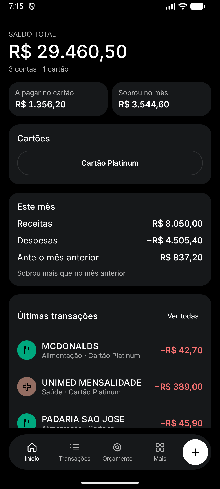 | 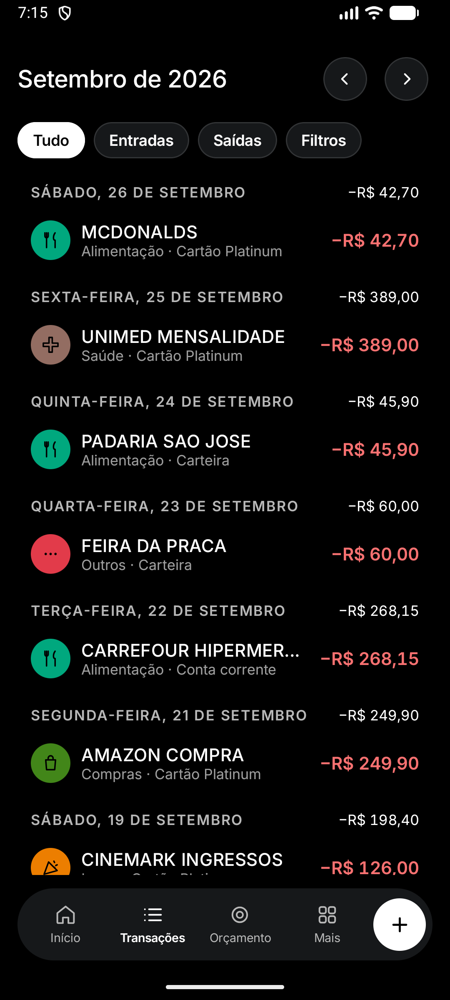 | 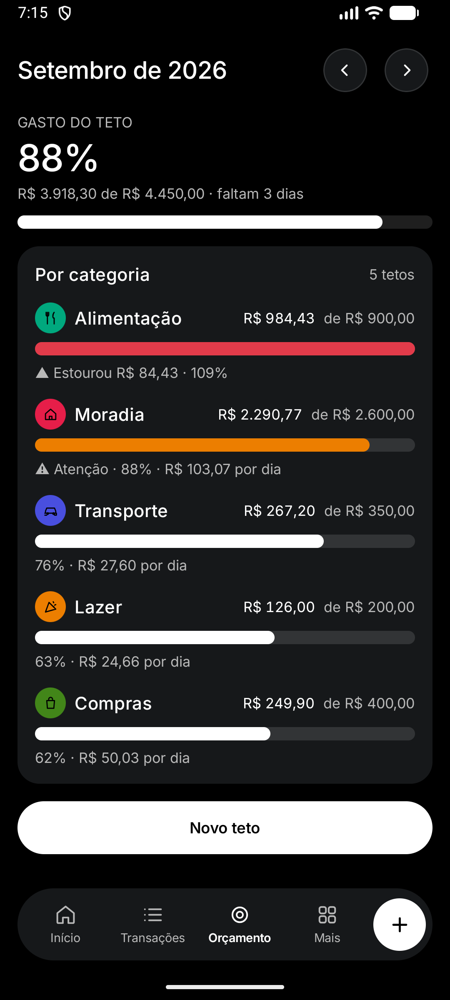 |

| Relatórios | Fatura do cartão | Investimentos |
|---|---|---|
| 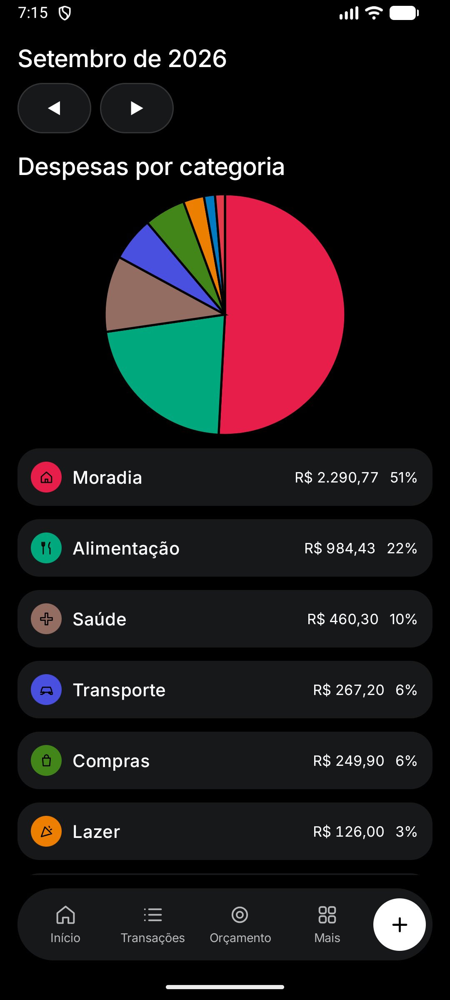 | 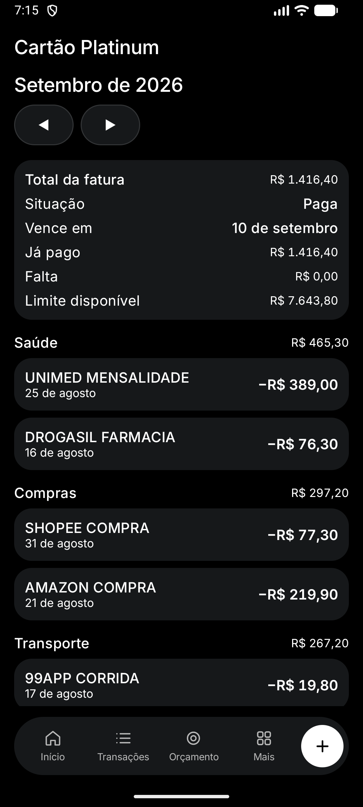 | 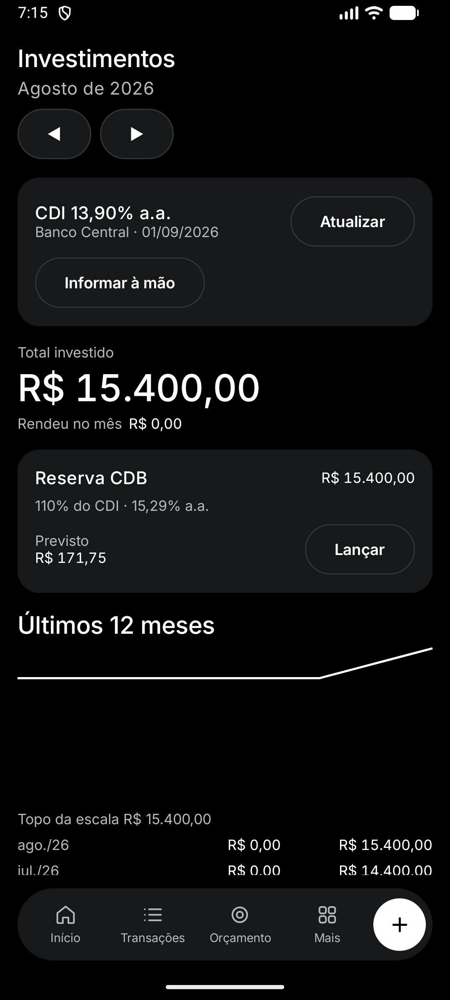 |

A tela **Mais** reúne cadastro, dados e análise:

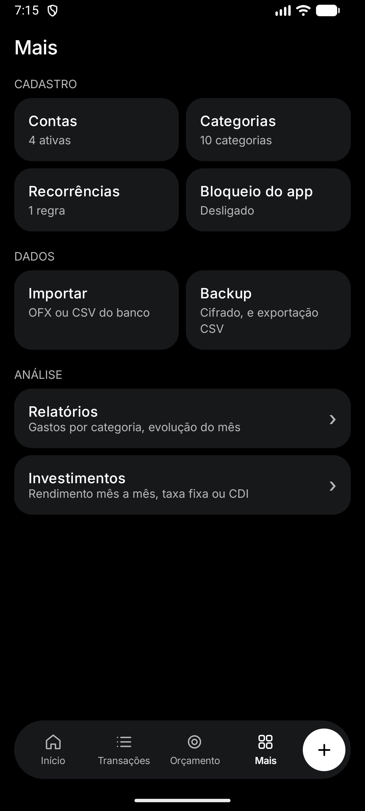

<details>
<summary><b>As mesmas telas no modo claro</b></summary>

<br>

| Início | Transações | Orçamento |
|---|---|---|
| 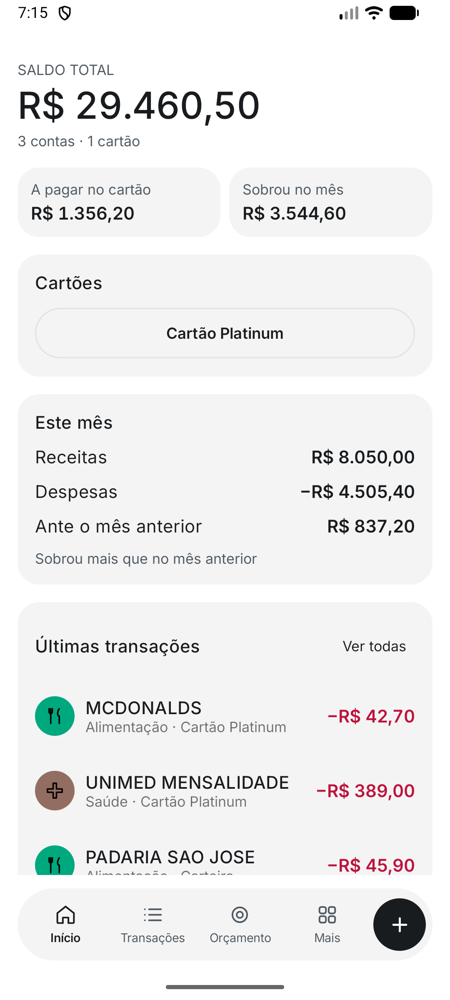 | 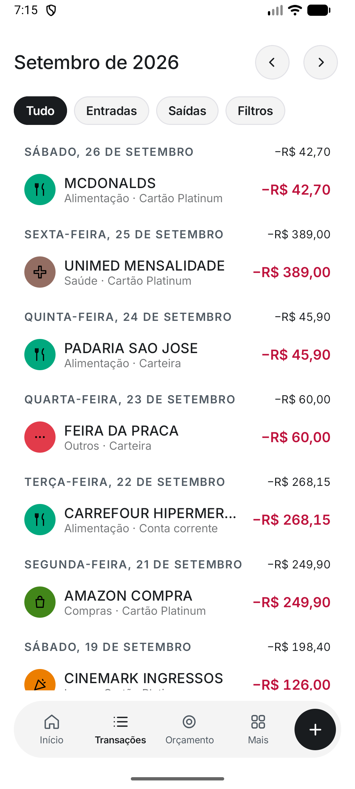 | 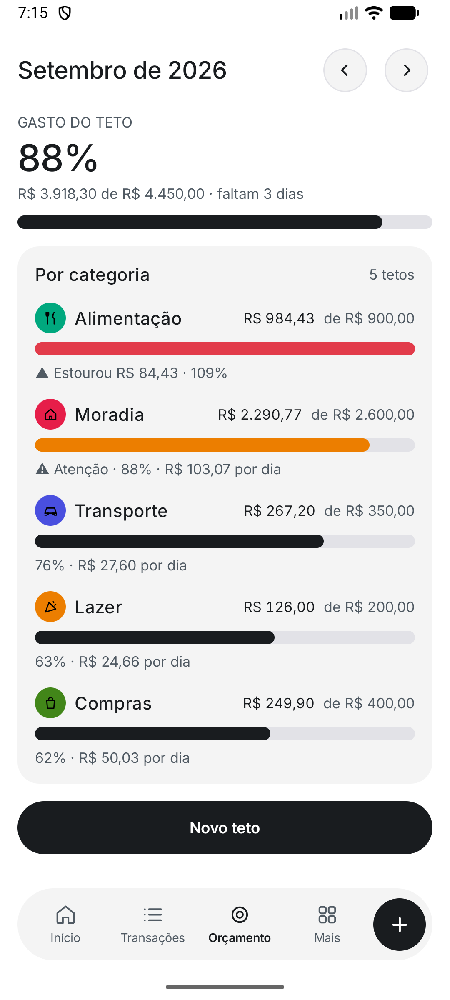 |

| Relatórios | Fatura do cartão | Investimentos |
|---|---|---|
| 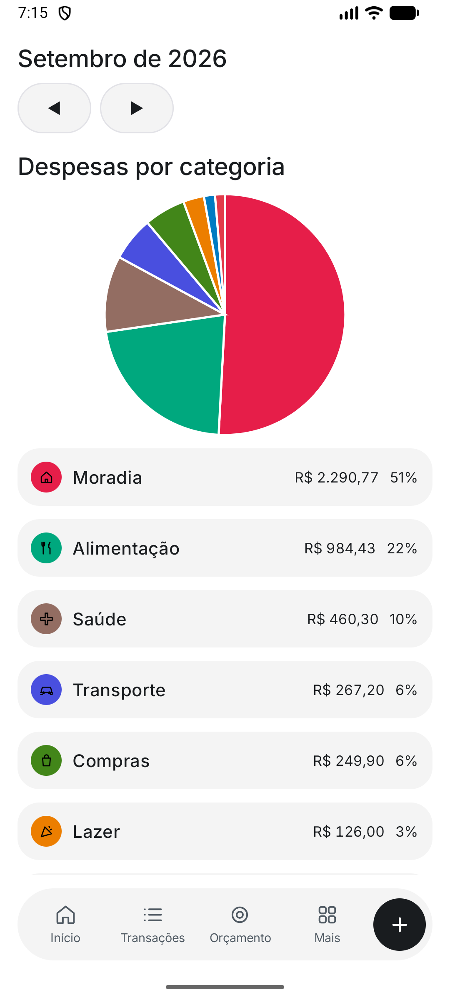 | 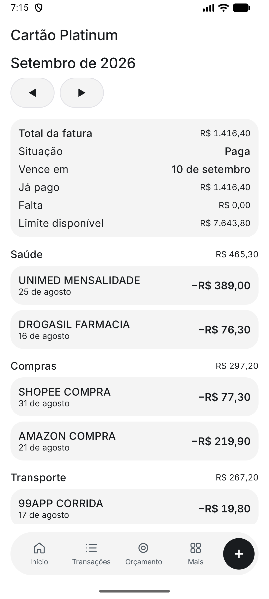 | 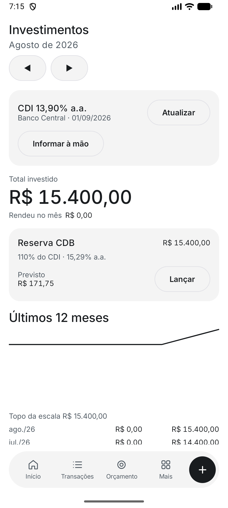 |

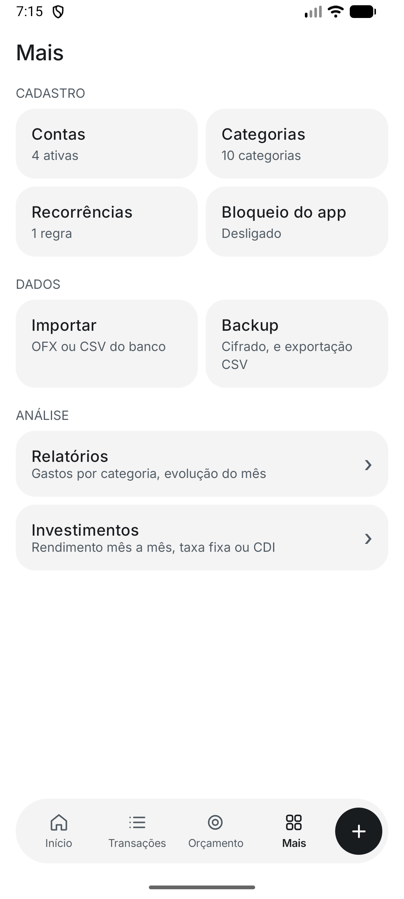

</details>

## Instalar

O APK assinado de cada versão está em
[Releases](https://github.com/dev-isaacportela/financepro/releases), com o
`.sha256` ao lado. Confira antes de instalar:

```bash
sha256sum -c financepro-v0.2.0.apk.sha256
```

Android 8.0 (API 26) ou mais novo. Não está na Play Store, então o aparelho vai
pedir permissão para instalar de fonte desconhecida.

Para compilar da fonte, `./gradlew assembleDebug` basta — o release sem keystore
sai não assinado, de propósito ([CONTRIBUTING.md](CONTRIBUTING.md)).

## Documentos

Leia nesta ordem:

| Documento | O que é | Quando consultar |
|---|---|---|
| [constitution.md](docs/constitution.md) | 18 regras invioláveis | Antes do primeiro commit. Uma vez. |
| [spec.md](docs/spec.md) | 127 requisitos `REQ-*` em EARS | Sempre. É a fonte de verdade. |
| [tasks.md](docs/tasks.md) | 53 tasks ordenadas, com "pronto quando" | Ao escolher o que fazer |
| [arquitetura.md](docs/arquitetura.md) | Camadas, schema, queries, testes | Ao implementar |
| [design.md](docs/design.md) | Sistema visual Slush traduzido para Compose | Ao construir qualquer tela |
| [ingestao.md](docs/ingestao.md) | Design das 3 camadas de importação | Nas fases F2–F4 |
| [decisoes.md](docs/decisoes.md) | 12 ADRs com o porquê e o que se perdeu | Antes de propor mudar uma decisão |

## O ciclo

```
1. spec.md      requisito em EARS, com ID e critério de aceite verificável
2. decisoes.md  se houver escolha de arquitetura, vira ADR antes do código
3. tasks.md     decompõe em task com dependências e definição de pronto
4. teste        escrito com @Req("REQ-..."), falhando
5. código       o mínimo que faz o teste passar
6. trace.py     rastreabilidade verificada antes do merge
```

Mudança de comportamento **começa no passo 1**, inclusive para "mudança pequena"
([Art. 1](docs/constitution.md#art-1--a-spec-vem-antes-do-código)). Se a
implementação divergir da spec, a spec ganha — ou a spec é corrigida no mesmo
commit ([Art. 3](docs/constitution.md#art-3--a-spec-é-a-verdade-divergência-é-bug-da-spec)).

### Rastreabilidade

```bash
python tools/trace.py
```

Sai com código ≠ 0 se algum `MUST` ficou sem task, se alguma task cita requisito
inexistente, se algum `@Req` no código aponta para requisito que não existe, ou
se as dependências entre tasks formam ciclo.

```bash
python tools/trace.py --phase F2
```

Exige, além disso, que todo `MUST` até a F0 tenha `@Req` no código. É o modo do CI
para uma fase já entregue.

```bash
python tools/trace.py --report
```

Só o inventário, sem falhar. Estado atual:

```
spec.md   127 requisitos
tasks.md  53 tasks, cobrindo 127
codigo    96 requisitos com @Req

  F0   62 requisitos (54 MUST, 38 com teste automatizado)
  F1   39 requisitos (33 MUST, 35 com teste automatizado)
  F2   16 requisitos (14 MUST, 13 com teste automatizado)
  F3    6 requisitos (5 MUST, 4 com teste automatizado)
  F4    4 requisitos (4 MUST, 0 com teste automatizado)
```

Rastreabilidade que depende de disciplina humana apodrece em duas semanas. Esta
não depende ([Art. 4](docs/constitution.md#art-4--rastreabilidade-é-verificada-por-máquina)).

## Stack

| Camada | Escolha | ADR |
|---|---|---|
| UI | Jetpack Compose + Material 3 | [ADR-001](docs/decisoes.md#adr-001--kotlin--jetpack-compose) |
| Navegação | Navigation Compose (rotas type-safe) | |
| DI | Hilt | |
| Persistência | Room + SQLCipher | [ADR-010](docs/decisoes.md#adr-010--sqlcipher-e-sem-permissão-de-rede-até-a-f4) |
| Preferências | DataStore | |
| Background | WorkManager | |
| Gráficos | `Canvas` do Compose, à mão | |
| Datas | `java.time` (`minSdk 26`) | |
| Testes | JUnit5 + Turbine + Room in-memory | |

Sem backend, sem login, sem analytics, e **sem permissão `INTERNET`** até a F4.

## Roadmap

| Fase | Entrega | Tasks | Bloqueio |
|---|---|---|---|
| **F0** | Contas, transações, categorias, saldo, dashboard | T-001…T-021 | — |
| **F1** | Cartão com fatura, orçamento, recorrências, relatórios, backup, investimento | T-022…T-035, T-050, T-051 | F0 |
| **F2** | Importação OFX/CSV com deduplicação | T-036…T-042 | F0 |
| **F3** | Captura por notificação bancária | T-043…T-046 | F2 |
| **F4** | Open Finance via agregador | T-047…T-049 | **CNPJ + contrato + backend** |

Ao fim da **F0** o app já substitui a planilha. A **F4** é a única fase com
bloqueio externo, é opt-in, e começa por um go/no-go (T-047) onde **não fazer** é
um resultado legítimo.

## As cinco decisões que carregam o app

Todas em [decisoes.md](docs/decisoes.md), com alternativas rejeitadas:

1. **Dinheiro é `Long` em centavos** — e o `Double` entra por parser, não por cálculo
2. **Transferência é uma linha**, não duas — e isso faz o pagamento de fatura funcionar sem código especial
3. **Fatura de cartão é derivada**, não é tabela — e `closingDay` restrito a 1–28 mata a classe de bugs de dia 31
4. **Parcelamento grava N linhas** na criação — com a sobra de centavos na última, e a soma batendo como teste
5. **Ingestão em três camadas** — porque SMS está barrado na Play e Open Finance exige CNPJ e backend

## Convenção de commit

```
feat(card): fatura agrupa por competência

REQ-CARD-003, REQ-CARD-004
```

Todo commit que muda comportamento cita ao menos um `REQ-*`
([Art. 2](docs/constitution.md#art-2--todo-código-responde-a-um-requisito)).

## Contribuindo

[CONTRIBUTING.md](CONTRIBUTING.md) tem o caminho completo. O resumo é que mudança
de comportamento começa na spec, e o `trace.py` reprova o PR que esquecer disso.

Falha de segurança não vai em issue pública. O caminho está em
[SECURITY.md](SECURITY.md).

## Licença

O projeto é [Apache License 2.0](LICENSE), copyright 2026 Isaac Portela.

A fonte empacotada em `app/src/main/res/font/inter.ttf` **não** segue essa
licença. Inter é da [SIL Open Font License 1.1](licenses/Inter-OFL.txt), que
exige o aviso de copyright junto de toda cópia do arquivo, inclusive dentro do
APK. O [NOTICE](NOTICE) carrega esse aviso, e `LicencaTest` reprova o build se
alguém empacotar uma fonte sem ele.
